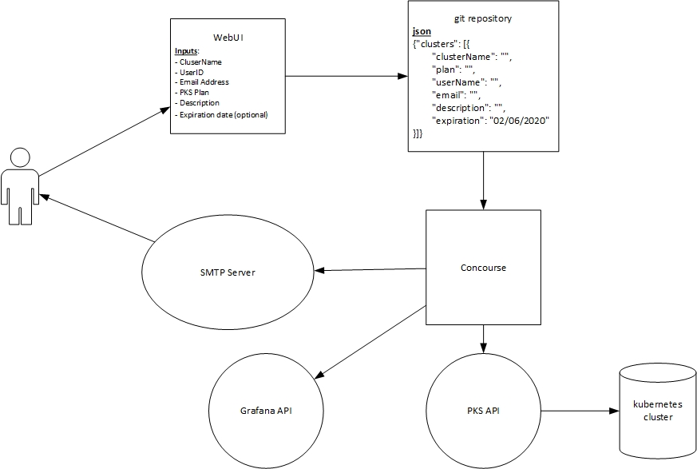
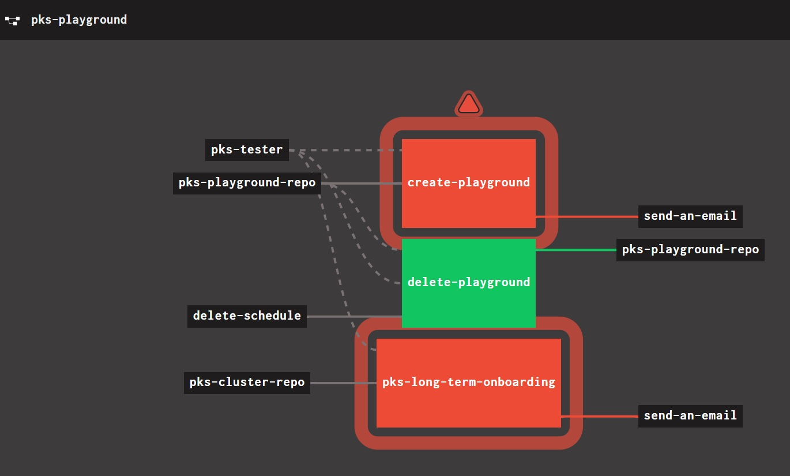

# PKS Self-Service Onboarding

Concourse pipeline to create PKS (Pivotal Kubernetes Service) clusters. 

## Getting Started

You will need:
- Concourse
- The provided docker image
- Access to a repository containing your cluster.json and/or playground.json files
- A front-end system to write to cluster.json and/or playground.json files

### Process Diagram


### Pipeline
- create-cluster.yml can be used to create clusters you plan keep
- pks-playground.yml contains the logic to create a long-term pks cluster or a test cluster to be deleted in 7 days.  This pipeline also contains the job the run the cleanup process for temporary clusters
  - cluster.json is used to store cluster owner data for long-term clusters
  - playground.json is used to maintain information about temporary clusters.  The playground will create a cluster avilable for 7 days.  Once the cluster expires, the cluster will be deleted via the concourse pipeline.
#### Process explanation
1) Pipeline is trigger upon commit to either cluster.json or playground.json
2) Grafana URL and PKS API are added to no_proxy list. (Remove if you are luckly enough to not have a Proxy server to mess with)
3) https://kubernetes-charts.storage.googleapis.com is added to helm repo list
4) Log into pks API
5) Reads from cluster.json or playground.json
6) For each cluster in the list, attempt to create. If it exists it will fail. No harm done.
7) Add master node IP to no_proxy
8) Add requestor to cluster manager binding
9) Create monitoring namespace to be used by Prometheus
10) Create a new storage class to be used by Prometheus persistent storage
11) Add prometheus-operator-operator to cluster developer role binding
12) Add service account
    1)  prometheus-operator-prometheus
    2)  prometheus-operator-admission
    3)  prometheus-operator-grafana
    4)  prometheus-operator-operator
13) Run helm to install prometheus. Alter to match your needs
```
helm upgrade prometheus-operator -i \
    -f pks-cluster-repo/${PKS_ENV}/values-prometheus.yml \
    --namespace monitoring \
    --set grafana.service.type=LoadBalancer \
    --set grafana.enabled=true \
    --set grafana.adminPassword=RandomP@55w0rd \
    --set global.rbac.pspEnabled=false \
    --set grafana.testFramework.enabled=false \
    --set alertmanager.enabled=false \
    --set prometheus.service.type=LoadBalancer \
    --set kubeTargetVersionOverride="$(kubectl version --short | grep -i server | awk '{print $3}' |  cut -c2-1000)" \
    stable/prometheus-operator
```
14) If Change made to cluster.json
    1)  Using provided Grafana URL and API token, the prometheus end-point is added your grafana data sources
15) Email is sent to the requestor with all information they need to connect to their new kubernetes cluster
##### Temporary cluster notification
```
bsmith, I'm happy to report you have a temporary fresh cluster named cluster1.  The userID bsmith has been granted the 
Cluster Manager Role binding.  Your cluster will be deleted on 03/02/2020

PKS Cluster creation results

PKS Version:              1.6.1-build.6
Name:                     cluster1
K8s Version:              1.15.5
Plan Name:                small
UUID:                     149e6751-b438-481a-9ae0-84be2583dd1c
Last Action:              CREATE
Last Action State:        succeeded
Last Action Description:  Instance provisioning completed
Kubernetes Master Host:   cluster1.xxxx.xxxx.xxx
Kubernetes Master Port:   8443
Worker Nodes:             3
Kubernetes Master IP(s):  x.x.116.93
Network Profile Name:      
________________________________________
Getting Started
Please follow the getting started link: GETTING STARTED
________________________________________
PKS Admins, if you so desire, add http://x.x.116.98:9090 as a new prometheus datasource

```
##### long-term cluster notification
```
bsmith, I'm happy to report you have a fresh cluster named long_term_cluster.  The userID bsmith has been granted the Cluster Manager Role binding.
PKS Cluster creation results

PKS Version:              1.6.1-build.6
Name:                     long_term_cluster
K8s Version:              1.15.5
Plan Name:                small
UUID:                     95cebdd8-fa44-4988-9da0-4143e18257c8
Last Action:              CREATE
Last Action State:        succeeded
Last Action Description:  Instance provisioning completed
Kubernetes Master Host:   long_term_cluster.xxxx.xxxx.xxx
Kubernetes Master Port:   8443
Worker Nodes:             1
Kubernetes Master IP(s):  xx.xx.116.156
Network Profile Name:      
________________________________________
Getting Started
Please follow the getting started link: GETTING STARTED
```

